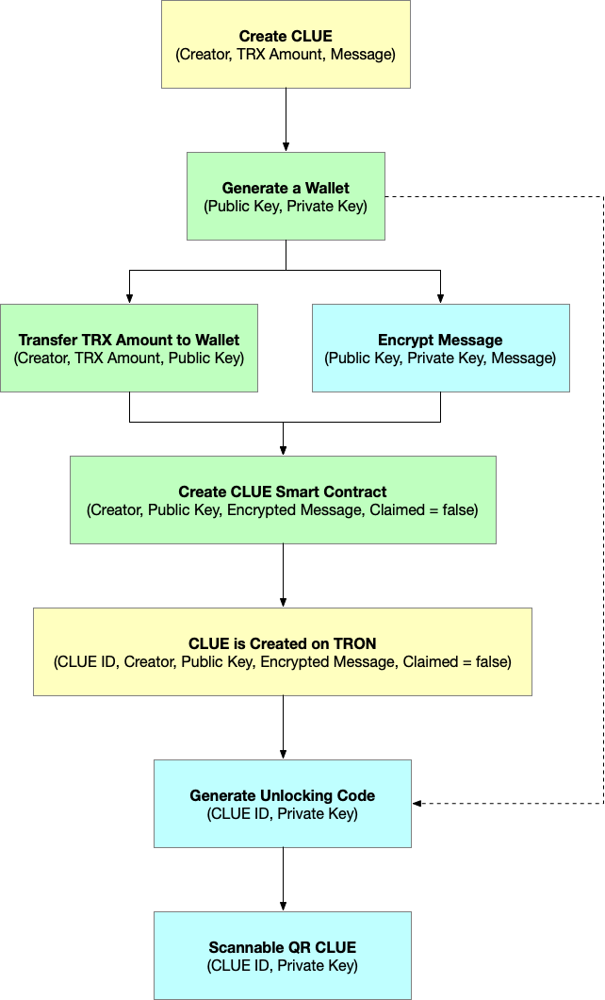

# CLUE: Decentralized Reward Unlocking Platform
tags: #clue #whitepaper

## Abstract
CLUE is a TRON-based decentralized reward unlocking platform, using smart contracts and modern cryptography. CLUE allows monetary rewards to be stored in a disposable wallet and can be claimed using an unlocking code comprised of CLUE ID and the private key of the wallet.

## CLUE Architecture
CLUE uses a unique method to store the reward in a disposable wallet, and use the wallet to generate a public key encrypted message.



*Figure 1* - Creating a CLUE

Upon creation of the CLUE, the unlocking code generated contains the following information:
```
<CLUE ID>.<Private Key>
```

The unlocking code contains all of the necessary information to unlock the CLUE. The CLUE ID represents the index which CLUE is stored on the smart contract, and the private key is to access the wallet for withdrawals and decrypting the encrypted message.

After CLUE is created, the creator will be able to generate either a QR Code or use our Unlocking API, which uses app links for instant unlocking.

The reward amount can be determined by checking the balance of the address on the disposable wallet.


*Figure 2* - Claiming a CLUE

Once the claimer gains access to the disposable wallet, the claimer can not only withdraw funds but also mark the CLUE as claimed, using  `msg.sender` to verify as the winner. The claimer’s address can be sent to the contract, allowing the claimer to record their address on the CLUE.

Once a CLUE is claimed, the new state of the CLUE is visible to the public, allowing interested parties to discover that the CLUE has been claimed, as well as see the claimer.

The unlocked CLUE can be claimed only once, with just one claimer per CLUE.

## Applications and Use Cases
There are a wide range of applications and use cases. CLUEs can be unlocked using the Unlocking API or a QR code, increasing the range of use cases in the modern connected world.

#### Scavenger Hunts
Allow the players to hunt for the CLUE which may lead to another CLUE, hidden in the encrypted message.

The game can be played both online and offline, providing a platform for all types of scavenger hunts.

#### Contests and Sweepstakes
Organize contests and sweepstakes with guaranteed winners, allow players to see the odds and prizes before participating.

Increase the amount of participation by offering a variety of rewards, with transparency and guaranteed odds.

#### Limited Edition Promotions
Generate limited edition promotional CLUEs to be distributed both online and offline.

Each CLUE can contain a variety of materials, including a unique URL that can be used as single-redeemable code.

#### In-App or In-Game Rewards
Offer CLUEs to customers as a token of appreciation, allowing them to unlock a range of rewards.

Each CLUE can contain promotional messages and will increase customer engagement on the platform as customers are rewarded in a unified system.

## CLUE DApp (iOS and Android)
In order to increase adoption and lower the barrier of entry, CLUE DApp will focus on optimizing the user experience for first-time users.

### DApp-specific Wallet
Interacting with DApps require having a wallet and basic understanding of how to use them. The user has to download the wallet application, store their private key in a safe place, and use browser plugins (MetaMask, etc) to interact existing DApps.

The barrier is pretty high considering there are several pre-requisite steps before interacting with DApps.

Instead of requiring a wallet, DApps should generate a new wallet as part of the sign-up process.

Having a wallet inside of the DApp will greatly lower the barrier, reducing the additional steps to get started by several factors.

#### Separation of Concern
Users are used to the concept of having multiple accounts for different services (Google, Facebook, LinkedIn, and etc), and the accounts are mutually exclusive to one another. If one account is compromised, then it’s safe to assume others won’t be affected (unless the user has the same password for all of their services).

From a user’s perspective, it is reasonable to assume that their primary account should be kept as private as possible, and a new account should be created with mutual exclusivity.

For the users on the DApp, the basic security model provided by application frameworks should be more than enough, and we should always encourage users to make frequent withdrawals.

### Use Common Lingos
From an average user’s perspective, some of the DApp lingos can be difficult to understand, and as humans, lack of understanding leads to lack of confidence.

For example, “Create a new Wallet” can also be described as, “Create an Account” which will help users make straightforward decisions on getting started.

### Features
  - TRX Wallet (send and receive TRX)
  - Unlock CLUE using the QR code or using Unlocking API (instantly claim rewards)
  - Store CLUEs on the device
  - Create a new CLUE
